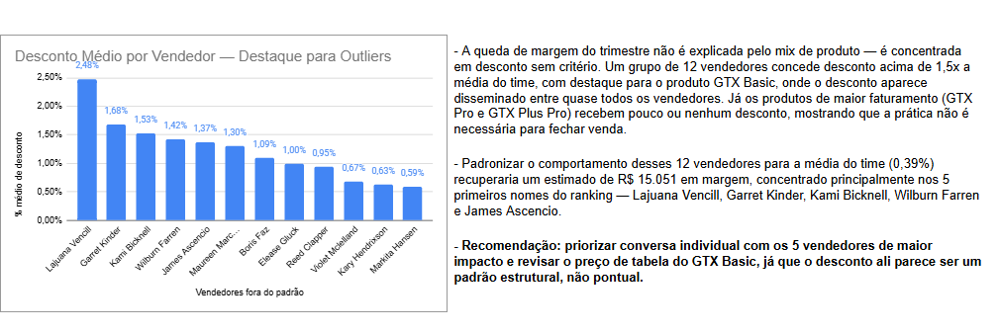

# Desconto por Vendedor: Onde Está a Margem Perdida?

**Cargo-alvo:** Analista Comercial / Analista de Performance Comercial
**Ferramentas:** Google Sheets (PROCX, Tabela Dinâmica, Formatação Condicional) — sem uso de ferramenta de BI
**Dataset:** CRM Sales Opportunities (Maven Tech) — Kaggle, autor innocentmfa
**Arquivos:** `sales_pipeline.csv` · `products.csv`

---

## Problema de Negócio

Uma distribuidora B2B de equipamentos de tecnologia percebeu, em reunião de resultado, que a margem do trimestre caiu — mas sem causa clara identificada. A dúvida da diretoria: a queda vem de mudança no mix de produto vendido, ou de desconto concedido sem critério pelos vendedores para bater meta? A resposta precisava ser dada no mesmo dia, sem tempo para montar um dashboard.

## Premissas

- **Desconto Implícito** = `(sales_price − close_value) / sales_price`, calculado apenas para oportunidades com `deal_stage = "Won"`.
- **Critério de outlier:** vendedor com desconto médio acima de **1,5x a média geral do time** (0,39% → limite de 0,58%).
- Valores negativos de Desconto Implícito (venda fechada **acima** do preço de tabela) foram mantidos na análise. Podem refletir venda de múltiplas unidades, add-ons, condições negociadas, ou desatualização do preço de referência no dataset — não necessariamente uma negociação real acima da tabela. Essa limitação foi documentada, não descartada.
- `sales_price` foi tratado como proxy de preço de tabela do produto.

## Perguntas de Negócio

1. Existe correlação entre o vendedor responsável e o valor médio de desconto implícito concedido?
2. Quais vendedores fecham consistentemente abaixo do preço de tabela, e em que magnitude?
3. Esse comportamento é concentrado em um produto específico ou é um padrão do vendedor, independente do que ele vende?
4. O desconto concedido está relacionado ao tamanho da oportunidade?
5. Quanto de receita foi "deixada na mesa" no total, comparado ao preço cheio de tabela?

## Estratégia da Solução

1. **PROCV** para trazer o `sales_price` de `products.csv` para dentro do pipeline, casando pela coluna `product`.
2. Coluna calculada de **Desconto Implícito** por oportunidade `Won`.
3. **Tabela dinâmica** agrupando por vendedor: Desconto Médio, Nº de Vendas, Receita Total — filtrada só por `Won`.
4. **Formatação condicional** para destacar automaticamente vendedores acima do limite de outlier.
5. **Matriz cruzada Vendedor x Produto** (Desconto Médio) para separar padrão de vendedor de padrão de produto.
6. Cálculo do **impacto financeiro agregado** e do **ganho estimado por vendedor outlier**.
7. Consolidação em **1 aba única de conclusão** — tabela + gráfico + recomendação em texto direto, sem dashboard.

## Insights

- **12 vendedores** (de um time bem maior) concedem desconto médio acima de 1,5x a média do time — o problema está concentrado, não espalhado por todo o time.
- **GTX Basic é o produto com desconto disseminado entre quase todos os vendedores**, inclusive os que em outros produtos vendem acima da tabela — forte indício de **problema de precificação do produto**, não só de negociação individual.
- Alguns vendedores (Garret Kinder, Wilburn Farren) mostram desconto alto e consistente **em vários produtos ao mesmo tempo** — indicando **padrão de comportamento individual** de negociação, independente do que vendem.
- Os produtos de **maior faturamento** (GTX Pro — R$ 3,5M; GTX Plus Pro — R$ 2,6M) são justamente os que **recebem menos desconto**, evidenciando que a concessão de desconto não é necessária para gerar receita — é um hábito de negociação a ser revisado, não uma exigência do mercado.
- O desconto líquido agregado (R$ 17.948) é pequeno em relação à receita total porque descontos e vendas acima da tabela se compensam na soma — um sinal de **falta de padrão no time**, e não de ausência de problema.

## Resultado / Impacto Financeiro

| Métrica | Valor |
|---|---|
| Receita teórica de tabela | R$ 10.023.482,00 |
| Receita real fechada | R$ 10.005.534,00 |
| Desconto total concedido (líquido) | R$ 17.948,00 |
| Vendedores fora do padrão | 12 |
| Média geral de desconto do time | 0,39% |
| **Ganho estimado ao padronizar os 12 outliers à média do time** | **R$ 15.051,15** |

**Mensagem-chave:**
> "Identifiquei 12 vendedores concedendo desconto médio acima de 1,5x a média do time, concentrados principalmente no produto GTX Basic. Padronizar esse comportamento à média do time recuperaria um estimado de R$ 15.051 em margem, com quase 70% desse valor concentrado nos 5 primeiros nomes do ranking (Lajuana Vencill, Garret Kinder, Kami Bicknell, Wilburn Farren e James Ascencio)."

## Próximos Passos

- Criar um alerta mensal automático (Google Apps Script) quando o desconto médio de um vendedor ultrapassar o limite de outlier definido (1,5x a média do time).
- Revisar o preço de tabela do GTX Basic junto à área de Pricing, já que o desconto nesse produto parece estrutural, não pontual.
- Priorizar conversas 1:1 com os 5 vendedores de maior impacto financeiro antes de abordar o grupo completo.
- Investigar, com dado real de CRM (histórico de preço por data), se os casos de venda "acima da tabela" são reajuste de preço não capturado ou negociação real — reduzindo a limitação assumida como premissa.
